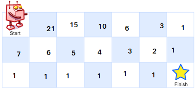

# 62_Unique_Paths.py

---

> * 问题
> * 代码
> * 思路

---

## 问题

62. 不同路径

一个机器人位于一个 m x n 网格的左上角 （起始点在下图中标记为“Start” ）。

机器人每次只能向下或者向右移动一步。机器人试图达到网格的右下角（在下图中标记为“Finish”）。

 

问总共有多少条不同的路径？

说明：m 和 n 的值均不超过 100。

示例 1:

输入: m = 3, n = 2

输出: 3

解释:

从左上角开始，总共有 3 条路径可以到达右下角。

\1. 向右 -> 向右 -> 向下

\2. 向右 -> 向下 -> 向右

\3. 向下 -> 向右 -> 向右

示例 2:

输入: m = 7, n = 3

输出: 28

## 代码

```python
class Solution:
    def uniquePaths(self, m, n):
        """
        :type m: int
        :type n: int
        :rtype: int
        """
        dp = [1 for _ in range(n)]
        for i in range(1,m):
            for j in range(1,n):
                dp[j] = dp[j]+dp[j-1]
        return dp[n-1]

if __name__=='__main__':
    sl=Solution()
    res=sl.uniquePaths(3,7)
    print(res)
```

## 思路

这道题让求所有不同的路径的个数，一开始还真把我难住了，因为之前好像没有遇到过这类的问题，所以感觉好像有种无从下手的感觉。

在网上找攻略之后才恍然大悟，原来这跟之前那道 Climbing Stairs 爬梯子问题 很类似，那道题是说可以每次能爬一格或两格，

问到达顶部的所有不同爬法的个数。而这道题是每次可以向下走或者向右走，求到达最右下角的所有不同走法的个数。那么跟爬梯子问题一样，

我们需要用动态规划Dynamic Programming来解，我们可以维护一个二维数组dp，其中dp[i][j]表示到当前位置不同的走法的个数，

然后可以得到递推式为: dp[i][j] = dp[i - 1][j] + dp[i][j - 1]，这里为了节省空间，我们使用一维数组dp，一行一行的刷新也可以